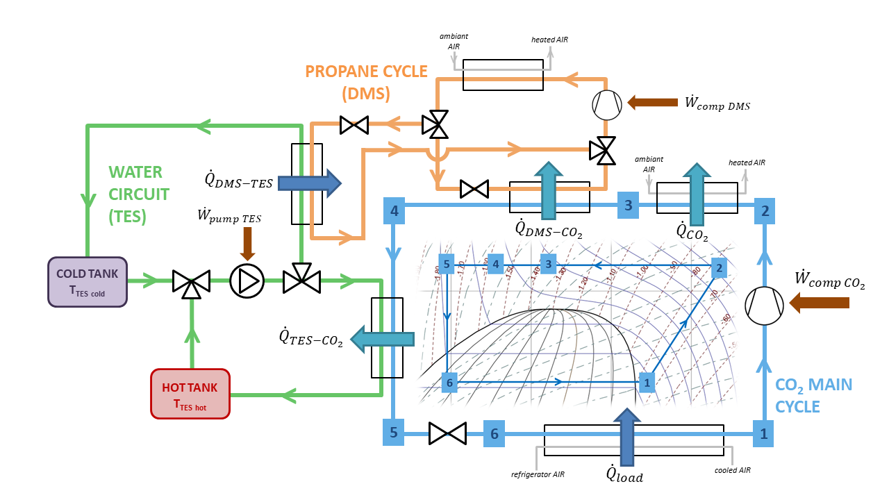
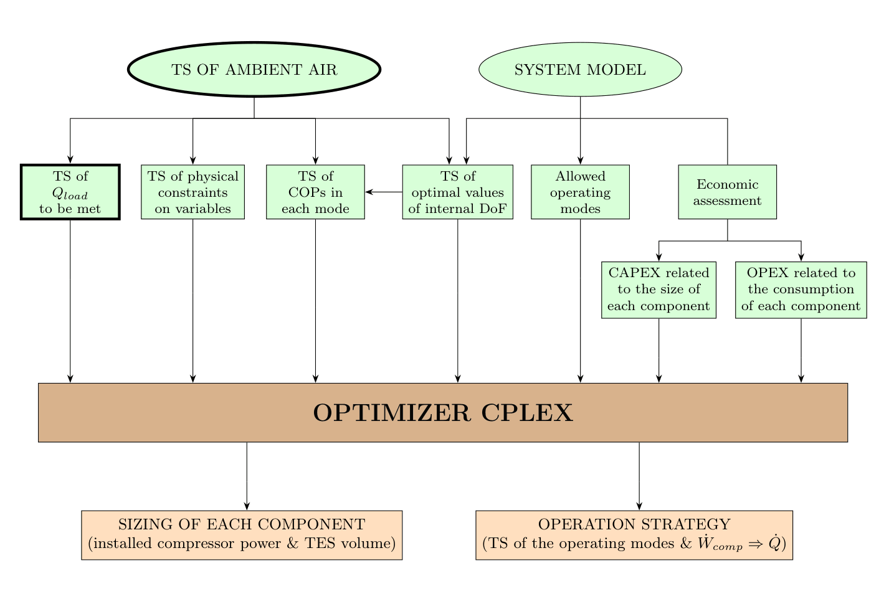

# Combined Thermal Energy Storage and Dedicated Mechanical Subcooling for CO2 refrigeration systems

This repository provides a complete workflow for modeling and optimizing **a CO2 refrigeration system**, enhanced with both Dedicated Mechanical Subcooling (**DMS**) and Thermal Energy Storage (**TES**).

This code has been written by Bastien Avrillon, as part of a 3-month research internship at the _Environment, Energy and Processes Center_ from november 2025 to february 2026. The work was supervised by Mr. Egoï Ortego and his doctoral student, Michael Khairallah.

At the conclusion of this project, a scientific article was written to present the approach and results. It can be found in `project_presentation/` and explains the meaning of this code in more details.

## Objective

This python repository aims at **modelling, optimizing and analizing the design and the operation strategy of a CO2 refrigeration system coupled with DMS and TES**.

## Studied system

The 3-component system is represented in the following figure, showing the different parts and their couplings. There are:

- the **main CO2 (R744) refrigeration cycle**, possibly subcritical or transcritical
- the **DMS system, using a propane (R290) cycle**
- the **TES system**, that can cool the main CO2 cycle or being charged by the propane cycle

### CO2–DMS–TES system architecture



## Case-study framework

This work is based on a concrete case study, which provides the input time series of external constraints needed for optimization (ambient air temperature, refrigeration load and electricity price signal). A supermarket in Madrid (Spain), whose refrigeration load was modeled in the literature, was selected.

## Methodology

The implemented method is summarized in the following figure. Numerous studies and pre-calculations are necessary before running the linear optimizer (CPLEX). It is then possible to analyze the outputs.

### Overall methodology



## Repository organization

- `CONSTANTS.py`: global constants of the system
- `cycles.py`: thermodynamic models of the cycles playing a role in the system
- `TES_settings.py`: model of the TES system and tools for assessing the impact of the storage parameters
- `opti_Ph.py`: pre-optimization of heat rejection pressure of the CO2 main cycle
- `opti_alpha.py`: pre-optimization of the DMS share
- `pinch_study/`: pre-calculations required to ensure the respect of the minimum temperature difference in the heat exchangers of the system and check on optimal operation strategy
- `optim_tools/`: linear optimization tools (including formatting of input data, CPLEX interface and extraction of the solution)
- `compute_all_settings.py`: computation of the optimal time series of the thermodynamic parameters (internal DoF of the system, COPs and physical constraints) required as inputs for linear optimization (pre-calculations)
- `execute_case_studies.py`: main script to run case studies (pre-calculations, linear optimization, solution extraction)
- `data/`: constant time series accross case studies
- `external_time_series/`: computation of the time-series required as inputs for linear optimization (electricity prices, cooling load, clustering, processed outputs).
- `explicative_plots/` : plotting scripts and generated figures to visualize the system (pre-calculated parameters, external time series, correlations,...)
- `case_studies/`: different scenarios studied (one subfolder = one case).
  - `monoN_XX`, `multiN_XX`, `DMS_only_XX`, `reference`: scenario families, each corresponding to a certain set of hyperparameters :
    - _mono_ or _multi_ = strategy for TES, with fixed or variable storage temperatures
    - _N_ = ID of the strategy for TES, setting the temperature values
    - _XX_ = derived from $\alpha_{max} = 0.XX$ the maximal share of DMS
  - Typical case structure (in the subfolder of a scenario): `thermo_optim_inputs/`, `optim_solver/`, `plots/`.

### Visual repository architecture

```text
├── compute_all_settings.py
├── CONSTANTS.py
├── cycles.py
├── execute_case_studies.py
├── opti_alpha.py
├── opti_Ph.py
├── README.md
├── TES_settings.py
├── case_studies/
│   ├── COMPARAISON/
│   │   ├── cases_comparison.py
│   │   └── cases_comparison_plots/
│   ├── DMS_only_XX/
│   │   ├── optim_solver/
│   │   ├── plots/
│   │   └── thermo_optim_inputs/
│   ├── monoN_XX/
│   │   ├── optim_solver/
│   │   ├── plots/
│   │   └── thermo_optim_inputs/
│   ├── multiN_XX/
│   │   ├── optim_solver/
│   │   ├── plots/
│   │   └── thermo_optim_inputs/
│   └── reference/
├── data/
├── explicative_plots/
│   ├── CAPEX_assessment_tools.py
│   ├── compressor_isen_efficiency.py
│   ├── cycle_Popt_TES_only.py
│   ├── cycle_Popt_vs_SUB_or_alpha.py
│   ├── cycles_from_settings.py
│   ├── opti_param_vs_Tamb_and_DMS.py
│   ├── opti_param_vs_Tamb.py
│   ├── param_series_from_settings.py
│   ├── data_plots_3D/
│   └── plots/
├── external_time_series/
│   ├── clustering_and_T/
│   ├── electricity_prices/
│   ├── outputs_external_time_series/
│   └── Qload/
├── optim_tools/
│   ├── settings_fitting_DAT.py
│   └── solver_CPLEX/
├── pinch_study/
│   ├── check_pinch_optim_settings.py
│   └── compute_pinch_air.py
└── project_presentation/
```
